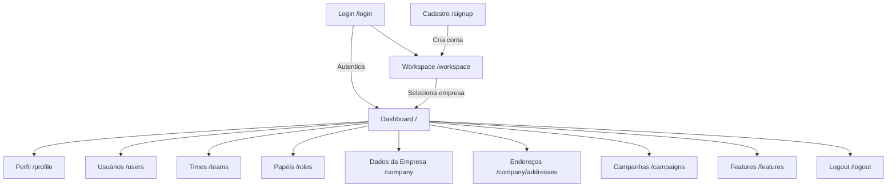

# Mapa de Telas

Consulte este documento quando precisar entender o fluxo de navegação entre telas e validar coerência entre menu, rotas e páginas Inertia.

## Diagrama de Fluxo

## Coerência Menu x Rotas x Tela

| Item de menu | Rota | Implementação de tela | Status |
| --- | --- | --- | --- |
| Home | `/` | `inertia/pages/home.vue` | Coerente |
| Perfil | `/profile` | `inertia/pages/profile.vue` | Coerente |
| Usuários | `/users` | `inertia/pages/admin/users.vue` | Coerente |
| Times | `/teams` | `inertia/pages/admin/teams.vue` | Coerente |
| Papéis | `/roles` | `inertia/pages/admin/roles.vue` | Coerente |
| Features | `/features` | `inertia/pages/admin/features.vue` | Coerente em localhost/admin |
| Dados da Empresa | `/company` | `inertia/pages/placeholder.vue` | Coerente (placeholder) |
| Endereços | `/company/addresses` | `inertia/pages/placeholder.vue` | Coerente (placeholder) |
| Campanhas | `/campaigns` | `inertia/pages/placeholder.vue` | Coerente (placeholder) |

## Ajuste aplicado nesta validação

- Foi corrigida incoerência no modo com subdomínio (`tenant`) adicionando as rotas:
- `/company/edit`
- `/company/addresses`
- `/company/addresses/create`

Com isso, os links de menu da área Empresa passam a ter destino consistente também fora do modo localhost.

## Observações

- O menu é dinâmico e vem de `FeatureService`, com base em role e features ativas.
- Itens marcados como `isMenuItem: false` (ex.: criar/editar) não aparecem no menu e são fluxos secundários.
- `Features (/features)` é funcional no admin/localhost e depende do contexto de acesso para aparecer no menu.
