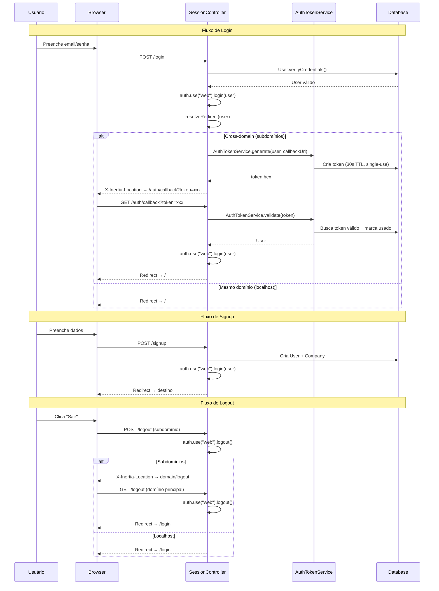
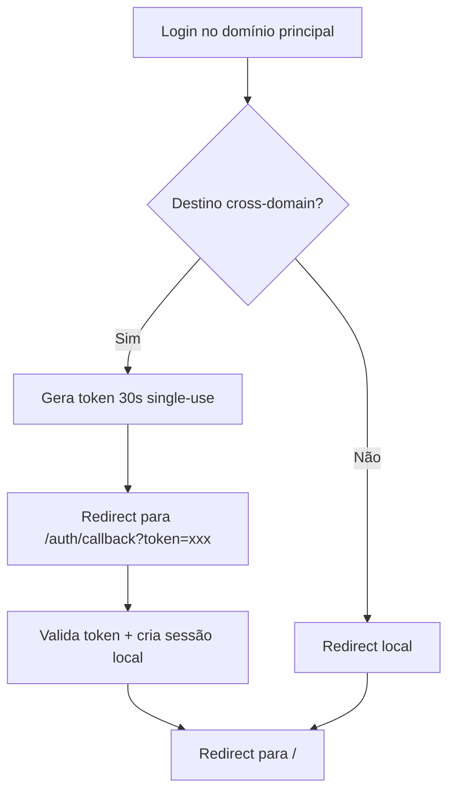

# Auth Flow — Fluxo de Autenticação

> Arquivo gerado automaticamente por `node ace graph:generate`. Não edite manualmente.

## Diagrama de Sequência

```mermaid
sequenceDiagram
  participant U as Usuário
  participant B as Browser
  participant S as SessionController
  participant T as AuthTokenService
  participant DB as Database

  Note over U,DB: Fluxo de Login
  U->>B: Preenche email/senha
  B->>S: POST /login
  S->>DB: User.verifyCredentials()
  DB-->>S: User válido
  S->>S: auth.use("web").login(user)
  S->>S: resolveRedirect(user)
  alt Cross-domain (subdomínios)
    S->>T: AuthTokenService.generate(user, callbackUrl)
    T->>DB: Cria token (30s TTL, single-use)
    T-->>S: token hex
    S-->>B: X-Inertia-Location → /auth/callback?token=xxx
    B->>S: GET /auth/callback?token=xxx
    S->>T: AuthTokenService.validate(token)
    T->>DB: Busca token válido + marca usado
    T-->>S: User
    S->>S: auth.use("web").login(user)
    S-->>B: Redirect → /
  else Mesmo domínio (localhost)
    S-->>B: Redirect → /
  end

  Note over U,DB: Fluxo de Signup
  U->>B: Preenche dados
  B->>S: POST /signup
  S->>DB: Cria User + Company
  S->>S: auth.use("web").login(user)
  S-->>B: Redirect → destino

  Note over U,DB: Fluxo de Logout
  U->>B: Clica "Sair"
  B->>S: POST /logout (subdomínio)
  S->>S: auth.use("web").logout()
  alt Subdomínios
    S-->>B: X-Inertia-Location → domain/logout
    B->>S: GET /logout (domínio principal)
    S->>S: auth.use("web").logout()
    S-->>B: Redirect → /login
  else Localhost
    S-->>B: Redirect → /login
  end
```

## Token Cross-Domain

```mermaid
flowchart TD
  A[Login no domínio principal] --> B{Destino cross-domain?}
  B -->|Sim| C[Gera token 30s single-use]
  B -->|Não| D[Redirect local]
  C --> E[Redirect para /auth/callback?token=xxx]
  E --> F[Valida token + cria sessão local]
  F --> G[Redirect para /]
  D --> G
```
