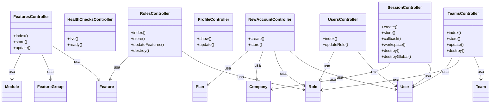

# Controllers — Diagrama de Classes

> Arquivo gerado automaticamente por `node ace graph:generate`. Não edite manualmente.

## Diagrama

## Tabela de Controllers

| Controller | Métodos | Models | Páginas | Flash |
| --- | --- | --- | --- | --- |
| FeaturesController | index, store, update | feature, feature_group, module | admin/features | - |
| HealthChecksController | live, ready | - | - | - |
| NewAccountController | create, store | user, role, company, plan | auth/register | error: Configuração inicial incompleta. Execute os seeders para criar as permissões. |
| ProfileController | show, update | - | profile | error: Arquivo de avatar inválido. Use JPG, PNG ou WEBP até 2MB.; error: Arquivo de capa inválido. Use JPG, PNG ou WEBP até 4MB.; success: Perfil atualizado com sucesso. |
| RolesController | index, store, updateFeatures, destroy | role, feature | admin/roles | error: A role owner tem acesso irrestrito e não precisa de permissões.; error: Não é possível remover roles do sistema.; success: Role removida. |
| SessionController | create, store, callback, workspace, destroy, destroyGlobal | user, company | auth/login, workspace | error: E-mail ou senha incorretos |
| TeamsController | index, store, update, destroy | team, role, user | admin/teams | success: Time removido. |
| UsersController | index, updateRole | user, role | admin/users | error: Não é possível alterar a role do owner.; success: Role atualizada com sucesso. |
