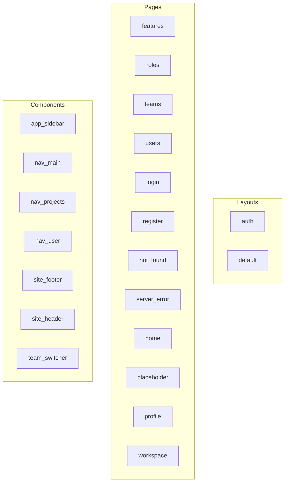

# Frontend — Mapa de Componentes

> Arquivo gerado automaticamente por `node ace graph:generate`. Não edite manualmente.

## Diagrama

## Tabela de Frontend

| Nome | Tipo | Path | Props | Composables | Layout |
| --- | --- | --- | --- | --- | --- |
| features | page | inertia/pages/admin/features.vue | - | useForm | - |
| roles | page | inertia/pages/admin/roles.vue | - | useForm, router | - |
| teams | page | inertia/pages/admin/teams.vue | - | useForm, router | - |
| users | page | inertia/pages/admin/users.vue | - | router | - |
| login | page | inertia/pages/auth/login.vue | class | usePage | Auth |
| register | page | inertia/pages/auth/register.vue | class | usePage | Auth |
| not_found | page | inertia/pages/errors/not_found.vue | - | - | - |
| server_error | page | inertia/pages/errors/server_error.vue | - | - | - |
| home | page | inertia/pages/home.vue | - | - | - |
| placeholder | page | inertia/pages/placeholder.vue | featureName, featureDescription | - | - |
| profile | page | inertia/pages/profile.vue | - | usePage, useForm | - |
| workspace | page | inertia/pages/workspace.vue | - | - | Auth |
| app_sidebar | component | inertia/components/app_sidebar.vue | - | usePage | - |
| nav_main | component | inertia/components/nav_main.vue | moduleTitle, moduleIcon, moduleIconClass, groups | usePage | - |
| nav_projects | component | inertia/components/nav_projects.vue | - | - | - |
| nav_user | component | inertia/components/nav_user.vue | - | - | - |
| site_footer | component | inertia/components/site_footer.vue | - | - | - |
| site_header | component | inertia/components/site_header.vue | - | usePage, router | - |
| team_switcher | component | inertia/components/team_switcher.vue | - | - | - |
| auth | layout | inertia/layouts/auth.vue | - | - | - |
| default | layout | inertia/layouts/default.vue | - | - | - |
