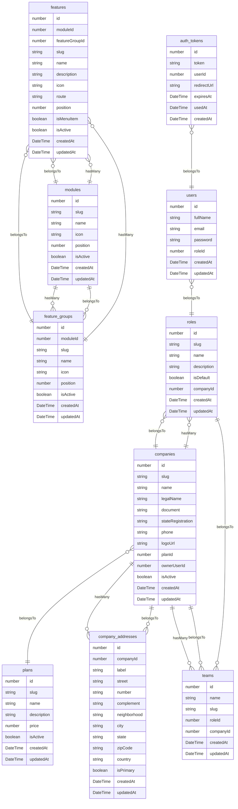
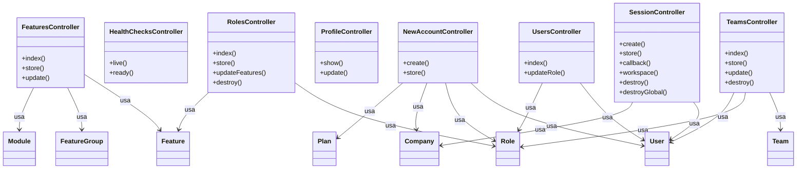
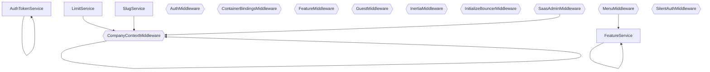
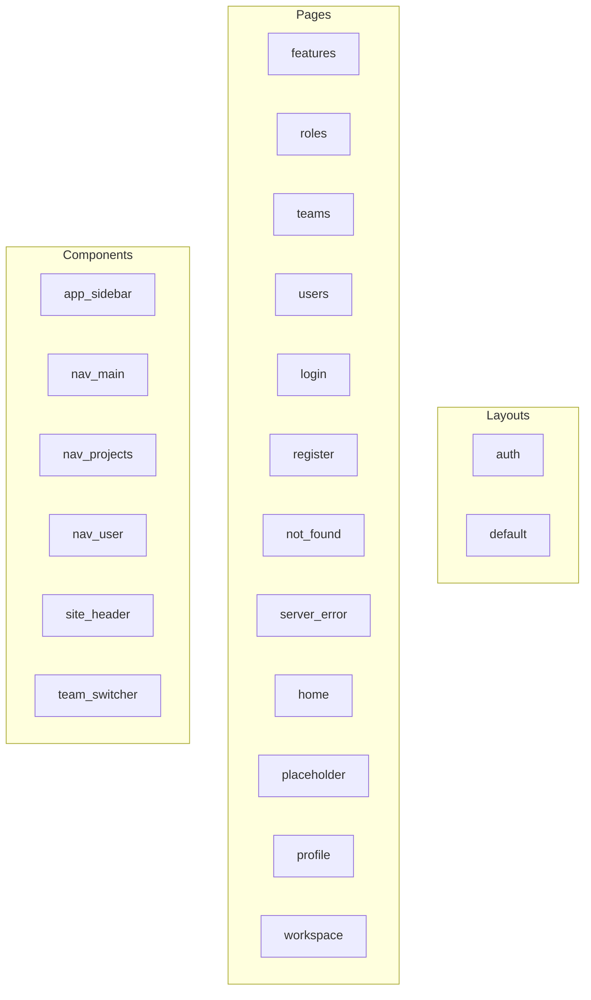
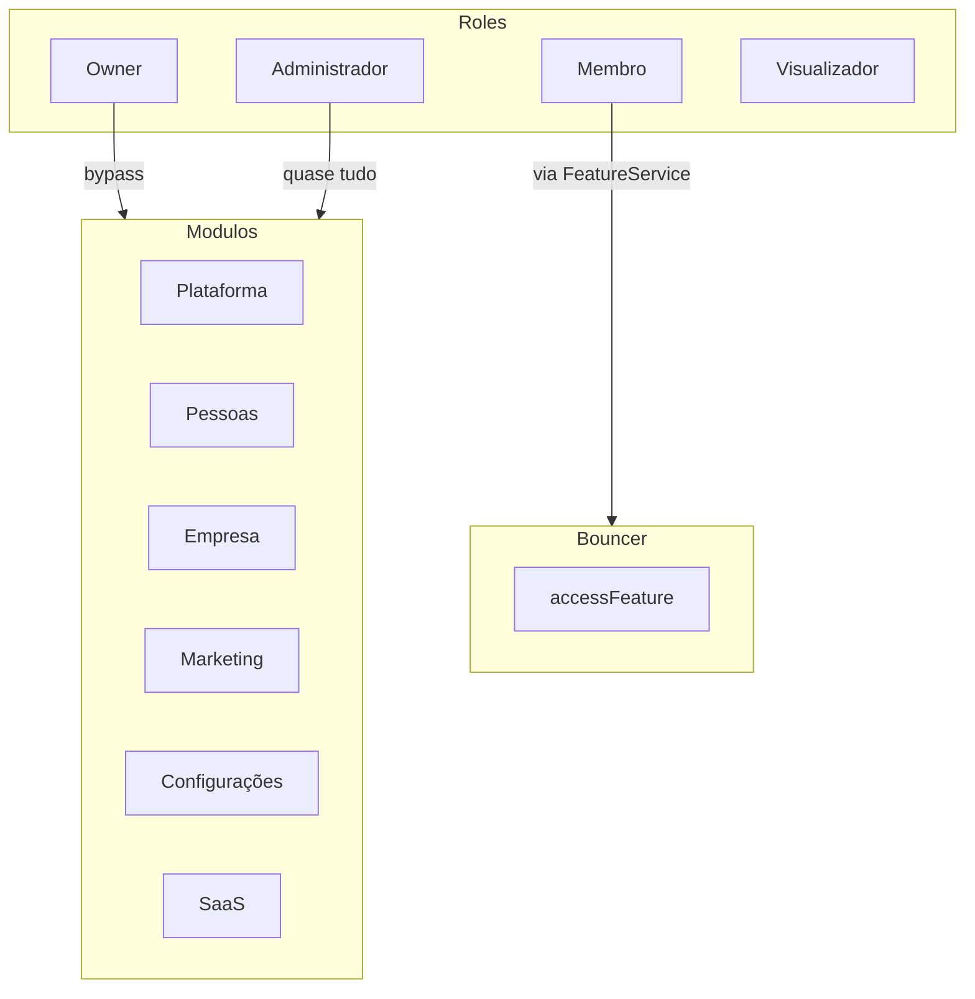
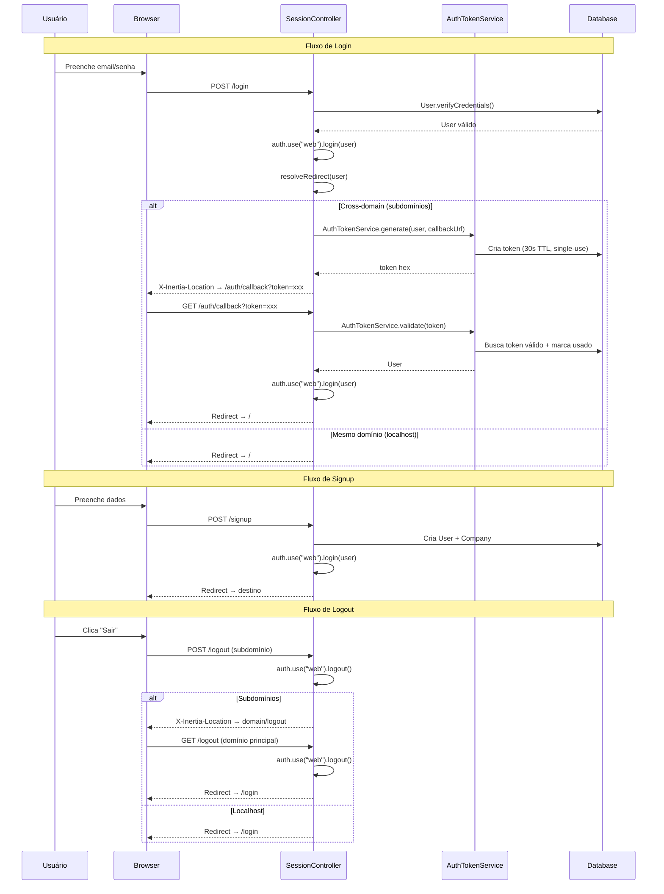
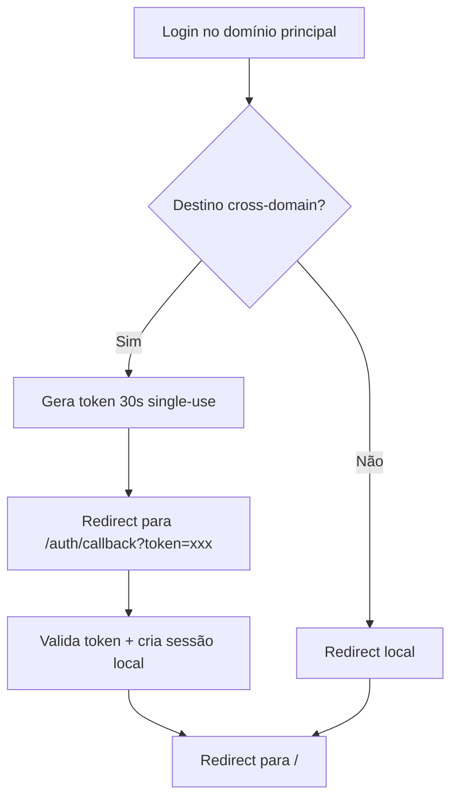

# Graph — Documentação Visual do Projeto

> Arquivo gerado automaticamente por `node ace graph:generate`. Não edite manualmente.

## Índice

- [Models](#models)
- [Routes](#routes)
- [Controllers](#controllers)
- [Services e Middleware](#services-e-middleware)
- [Frontend](#frontend)
- [Permissions](#permissions)
- [Auth Flow](#auth-flow)
- [Tests](#tests)

---

# Models — Diagrama ER

> Arquivo gerado automaticamente por `node ace graph:generate`. Não edite manualmente.

## Diagrama

## Tabela de Models

| Model | Tabela | Colunas | Relações |
| --- | --- | --- | --- |
| AuthToken | auth_tokens | id, token, userId, redirectUrl, expiresAt, usedAt, createdAt | belongsTo → User |
| Company | companies | id, slug, name, legalName, document, stateRegistration, phone, logoUrl, planId, ownerUserId, isActive, createdAt, updatedAt | belongsTo → Plan, hasMany → CompanyAddress, hasMany → Team, hasMany → Role |
| CompanyAddress | company_addresses | id, companyId, label, street, number, complement, neighborhood, city, state, zipCode, country, isPrimary, createdAt, updatedAt | belongsTo → Company |
| Feature | features | id, moduleId, featureGroupId, slug, name, description, icon, route, position, isMenuItem, isActive, createdAt, updatedAt | belongsTo → Module, belongsTo → FeatureGroup |
| FeatureGroup | feature_groups | id, moduleId, slug, name, icon, position, isActive, createdAt, updatedAt | belongsTo → Module, hasMany → Feature |
| Module | modules | id, slug, name, icon, position, isActive, createdAt, updatedAt | hasMany → FeatureGroup, hasMany → Feature |
| Plan | plans | id, slug, name, description, price, isActive, createdAt, updatedAt |  |
| Role | roles | id, slug, name, description, isDefault, companyId, createdAt, updatedAt | belongsTo → Company |
| Team | teams | id, name, slug, roleId, companyId, createdAt, updatedAt | belongsTo → Company, belongsTo → Role |
| User | users | id, fullName, email, password, roleId, createdAt, updatedAt | belongsTo → Role |

---

# Routes — Mapa de Rotas

> Arquivo gerado automaticamente por `node ace graph:generate`. Não edite manualmente.

## Diagrama

```mermaid
flowchart LR
  subgraph localhost
    signup["GET signup"]
    signup["POST signup"]
    login["GET login"]
    login["POST login"]
    auth_callback["GET auth/callback"]
    logout_global["GET logout"]
    workspace["GET workspace"]
    logout["POST logout"]
    workspace["GET workspace"]
    profile["GET profile"]
    profile_update["PATCH profile"]
    users["GET users"]
    users_updateRole["PATCH users/:id/role"]
    roles["GET roles"]
    roles_store["POST roles"]
    roles_updateFeatures["PATCH roles/:id/features"]
    roles_destroy["DELETE roles/:id"]
    teams["GET teams"]
    teams_store["POST teams"]
    teams_update["PATCH teams/:id"]
  end
  subgraph admin
    admin_profile["GET profile"]
    admin_profile_update["PATCH profile"]
    admin_users["GET users"]
    admin_users_updateRole["PATCH users/:id/role"]
    admin_roles["GET roles"]
    admin_roles_store["POST roles"]
    admin_roles_updateFeatures["PATCH roles/:id/features"]
    admin_roles_destroy["DELETE roles/:id"]
    admin_teams["GET teams"]
    admin_teams_store["POST teams"]
    admin_teams_update["PATCH teams/:id"]
    admin_teams_destroy["DELETE teams/:id"]
    admin_features["GET features"]
    admin_features_store["POST features"]
    admin_features_update["PATCH features/:id"]
    admin_logout["POST logout"]
    admin_campaigns["GET campaigns"]
    admin_campaigns_create["GET campaigns/create"]
    admin_settings["GET settings"]
    admin_home["GET /"]
  end
  subgraph tenant
    tenant_profile["GET profile"]
    tenant_profile_update["PATCH profile"]
    tenant_users["GET users"]
    tenant_users_updateRole["PATCH users/:id/role"]
    tenant_roles["GET roles"]
    tenant_roles_store["POST roles"]
    tenant_roles_updateFeatures["PATCH roles/:id/features"]
    tenant_roles_destroy["DELETE roles/:id"]
    tenant_teams["GET teams"]
    tenant_teams_store["POST teams"]
    tenant_teams_update["PATCH teams/:id"]
    tenant_teams_destroy["DELETE teams/:id"]
    tenant_logout["POST logout"]
    tenant_company["GET company"]
    tenant_campaigns["GET campaigns"]
    tenant_campaigns_create["GET campaigns/create"]
    tenant_settings["GET settings"]
    tenant_home["GET /"]
  end
```

## Tabela de Rotas

| Método | Path | Controller | Action | Nome | Domínio |
| --- | --- | --- | --- | --- | --- |
| GET | signup | NewAccount | create | - | localhost |
| POST | signup | NewAccount | store | - | localhost |
| GET | login | Session | create | - | localhost |
| POST | login | Session | store | - | localhost |
| GET | auth/callback | Session | callback | auth.callback | localhost |
| GET | logout | Session | destroyGlobal | logout.global | localhost |
| GET | workspace | Session | workspace | workspace | localhost |
| POST | logout | Session | destroy | logout | localhost |
| GET | profile | Profile | show | admin.profile | admin |
| PATCH | profile | Profile | update | admin.profile.update | admin |
| GET | users | Users | index | admin.users | admin |
| PATCH | users/:id/role | Users | updateRole | admin.users.updateRole | admin |
| GET | roles | Roles | index | admin.roles | admin |
| POST | roles | Roles | store | admin.roles.store | admin |
| PATCH | roles/:id/features | Roles | updateFeatures | admin.roles.updateFeatures | admin |
| DELETE | roles/:id | Roles | destroy | admin.roles.destroy | admin |
| GET | teams | Teams | index | admin.teams | admin |
| POST | teams | Teams | store | admin.teams.store | admin |
| PATCH | teams/:id | Teams | update | admin.teams.update | admin |
| DELETE | teams/:id | Teams | destroy | admin.teams.destroy | admin |
| GET | features | Features | index | admin.features | admin |
| POST | features | Features | store | admin.features.store | admin |
| PATCH | features/:id | Features | update | admin.features.update | admin |
| POST | logout | Session | destroy | admin.logout | admin |
| GET | profile | Profile | show | tenant.profile | tenant |
| PATCH | profile | Profile | update | tenant.profile.update | tenant |
| GET | users | Users | index | tenant.users | tenant |
| PATCH | users/:id/role | Users | updateRole | tenant.users.updateRole | tenant |
| GET | roles | Roles | index | tenant.roles | tenant |
| POST | roles | Roles | store | tenant.roles.store | tenant |
| PATCH | roles/:id/features | Roles | updateFeatures | tenant.roles.updateFeatures | tenant |
| DELETE | roles/:id | Roles | destroy | tenant.roles.destroy | tenant |
| GET | teams | Teams | index | tenant.teams | tenant |
| POST | teams | Teams | store | tenant.teams.store | tenant |
| PATCH | teams/:id | Teams | update | tenant.teams.update | tenant |
| DELETE | teams/:id | Teams | destroy | tenant.teams.destroy | tenant |
| POST | logout | Session | destroy | tenant.logout | tenant |
| GET | workspace | Session | workspace | workspace | localhost |
| GET | profile | Profile | show | profile | localhost |
| PATCH | profile | Profile | update | profile.update | localhost |
| GET | users | Users | index | users | localhost |
| PATCH | users/:id/role | Users | updateRole | users.updateRole | localhost |
| GET | roles | Roles | index | roles | localhost |
| POST | roles | Roles | store | roles.store | localhost |
| PATCH | roles/:id/features | Roles | updateFeatures | roles.updateFeatures | localhost |
| DELETE | roles/:id | Roles | destroy | roles.destroy | localhost |
| GET | teams | Teams | index | teams | localhost |
| POST | teams | Teams | store | teams.store | localhost |
| PATCH | teams/:id | Teams | update | teams.update | localhost |
| DELETE | teams/:id | Teams | destroy | teams.destroy | localhost |
| GET | features | Features | index | features | localhost |
| POST | features | Features | store | features.store | localhost |
| PATCH | features/:id | Features | update | features.update | localhost |
| POST | logout | Session | destroy | logout | localhost |
| GET | /workspace | Session | workspace | workspace.fallback | localhost |
| GET | campaigns | inline | renderInertia('placeholder') | admin.campaigns | admin |
| GET | campaigns/create | inline | renderInertia('placeholder') | admin.campaigns.create | admin |
| GET | settings | inline | renderInertia('placeholder') | admin.settings | admin |
| GET | company | inline | renderInertia('placeholder') | tenant.company | tenant |
| GET | campaigns | inline | renderInertia('placeholder') | tenant.campaigns | tenant |
| GET | campaigns/create | inline | renderInertia('placeholder') | tenant.campaigns.create | tenant |
| GET | settings | inline | renderInertia('placeholder') | tenant.settings | tenant |
| GET | company | inline | renderInertia('placeholder') | company | localhost |
| GET | company/edit | inline | renderInertia('placeholder') | company.edit | localhost |
| GET | company/addresses | inline | renderInertia('placeholder') | company.addresses.list | localhost |
| GET | company/addresses/create | inline | renderInertia('placeholder') | company.addresses.create | localhost |
| GET | campaigns | inline | renderInertia('placeholder') | campaigns | localhost |
| GET | campaigns/create | inline | renderInertia('placeholder') | campaigns.create | localhost |
| GET | settings | inline | renderInertia('placeholder') | settings | localhost |
| GET | / | inline | renderInertia('home') | admin.home | admin |
| GET | / | inline | renderInertia('home') | tenant.home | tenant |
| GET | / | inline | renderInertia('home') | home | localhost |

---

# Controllers — Diagrama de Classes

> Arquivo gerado automaticamente por `node ace graph:generate`. Não edite manualmente.

## Diagrama

## Tabela de Controllers

| Controller | Métodos | Models | Páginas | Flash |
| --- | --- | --- | --- | --- |
| FeaturesController | index, store, update | feature, feature_group, module | admin/features | - |
| HealthChecksController | live, ready | - | - | - |
| NewAccountController | create, store | user, role, company, plan | auth/register | error: Configuração inicial incompleta. Execute os seeders para criar as permissões. |
| ProfileController | show, update | - | profile | success: Perfil atualizado com sucesso. |
| RolesController | index, store, updateFeatures, destroy | role, feature | admin/roles | error: A role owner tem acesso irrestrito e não precisa de permissões.; error: Não é possível remover roles do sistema.; success: Role removida. |
| SessionController | create, store, callback, workspace, destroy, destroyGlobal | user, company | auth/login, workspace | error: E-mail ou senha incorretos |
| TeamsController | index, store, update, destroy | team, role, user | admin/teams | success: Time removido. |
| UsersController | index, updateRole | user, role | admin/users | error: Não é possível alterar a role do owner.; success: Role atualizada com sucesso. |

---

# Services & Middleware — Grafo de Dependências

> Arquivo gerado automaticamente por `node ace graph:generate`. Não edite manualmente.

## Diagrama

## Tabela de Services e Middleware

| Nome | Tipo | Imports | Métodos |
| --- | --- | --- | --- |
| AuthTokenService | service | #models/auth_token, #models/user | generate, validate, cleanup |
| FeatureService | service | #models/feature, #models/module, #models/user | getUserFeatures, getUserMenu, userCanAccess, loadUserRoleSlug |
| LimitService | service | #models/company, #models/module | check, canCreateUser, canCreateTeam |
| SlugService | service | #models/company | slugify, generateCompanySlug |
| AuthMiddleware | middleware | - | handle |
| CompanyContextMiddleware | middleware | #models/company | handle |
| ContainerBindingsMiddleware | middleware | - | - |
| FeatureMiddleware | middleware | - | handle |
| GuestMiddleware | middleware | - | handle |
| InertiaMiddleware | middleware | - | handle |
| InitializeBouncerMiddleware | middleware | - | handle |
| MenuMiddleware | middleware | #services/feature_service | handle |
| SaasAdminMiddleware | middleware | #models/company | handle |
| SilentAuthMiddleware | middleware | - | handle |

---

# Frontend — Mapa de Componentes

> Arquivo gerado automaticamente por `node ace graph:generate`. Não edite manualmente.

## Diagrama

## Tabela de Frontend

| Nome | Tipo | Path | Props | Composables | Layout |
| --- | --- | --- | --- | --- | --- |
| features | page | inertia/pages/admin/features.vue | - | useForm | - |
| roles | page | inertia/pages/admin/roles.vue | - | useForm, router | - |
| teams | page | inertia/pages/admin/teams.vue | - | useForm, router | - |
| users | page | inertia/pages/admin/users.vue | - | router | - |
| login | page | inertia/pages/auth/login.vue | class | usePage | Auth |
| register | page | inertia/pages/auth/register.vue | class | usePage | Auth |
| not_found | page | inertia/pages/errors/not_found.vue | - | - | - |
| server_error | page | inertia/pages/errors/server_error.vue | - | - | - |
| home | page | inertia/pages/home.vue | - | - | - |
| placeholder | page | inertia/pages/placeholder.vue | featureName, featureDescription | - | - |
| profile | page | inertia/pages/profile.vue | - | usePage, useForm | - |
| workspace | page | inertia/pages/workspace.vue | - | - | Auth |
| app_sidebar | component | inertia/components/app_sidebar.vue | - | usePage | - |
| nav_main | component | inertia/components/nav_main.vue | moduleTitle, moduleIcon, groups | usePage | - |
| nav_projects | component | inertia/components/nav_projects.vue | - | - | - |
| nav_user | component | inertia/components/nav_user.vue | - | - | - |
| site_header | component | inertia/components/site_header.vue | - | usePage, router | - |
| team_switcher | component | inertia/components/team_switcher.vue | - | - | - |
| auth | layout | inertia/layouts/auth.vue | - | - | - |
| default | layout | inertia/layouts/default.vue | - | - | - |

---

# Permissions — Mapa de Permissões

> Arquivo gerado automaticamente por `node ace graph:generate`. Não edite manualmente.

## Diagrama

## Roles

| Slug | Nome | Descrição |
| --- | --- | --- |
| owner | Owner | Super admin do SaaS. Acesso irrestrito. |
| admin | Administrador | Proprietário de company. Acesso total dentro do plano. |
| member | Membro | Acesso às features da sua role e teams. |
| viewer | Visualizador | Apenas leitura. |

## Módulos

| Slug | Nome |
| --- | --- |
| plataforma | Plataforma |
| pessoas | Pessoas |
| empresa | Empresa |
| marketing | Marketing |
| configuracoes | Configurações |
| saas | SaaS |

## Features

| Slug | Nome | Rota |
| --- | --- | --- |
| home | Home | / |
| profile | Perfil | /profile |
| users.list | Usuários | /users |
| users.create | Criar Usuário | /users/create |
| teams.list | Times | /teams |
| teams.create | Criar Time | /teams/create |
| company.view | Dados da Empresa | /company |
| company.edit | Editar Empresa | /company/edit |
| company.addresses.list | Endereços | /company/addresses |
| company.addresses.create | Novo Endereço | /company/addresses/create |
| campaigns.list | Campanhas | /campaigns |
| campaigns.create | Criar Campanha | /campaigns/create |
| roles.list | Papéis | /roles |
| roles.create | Criar Papel | /roles/create |
| features.list | Features | /features |
| features.create | Criar Feature | /features/create |
| features.edit | Editar Feature | /features/:id/edit |

## Bouncer Rules

| Rule |
| --- |
| accessFeature |

---

# Auth Flow — Fluxo de Autenticação

> Arquivo gerado automaticamente por `node ace graph:generate`. Não edite manualmente.

## Diagrama de Sequência

## Token Cross-Domain

---

# Tests — Mapa de Testes

> Arquivo gerado automaticamente por `node ace graph:generate`. Não edite manualmente.

## Resumo

- **Total de testes**: 36
- **Browser tests**: 15 (7 arquivos)
- **Functional tests**: 21 (3 arquivos)

## Detalhamento

| Arquivo | Tipo | Grupo | Testes | URLs |
| --- | --- | --- | --- | --- |
| tests/browser/auth.spec.ts | browser | Browser - Autenticação | 4 | /login, /signup |
| tests/browser/features.spec.ts | browser | Browser - CRUD Features | 1 | /login |
| tests/browser/navigation.spec.ts | browser | Browser - Navegação e Menu | 3 | /login |
| tests/browser/profile.spec.ts | browser | Browser - Perfil | 2 | /login |
| tests/browser/roles.spec.ts | browser | Browser - CRUD Roles | 2 | /login |
| tests/browser/teams.spec.ts | browser | Browser - CRUD Teams | 2 | /login |
| tests/browser/users.spec.ts | browser | Browser - CRUD Users | 1 | /login |
| tests/functional/auth.spec.ts | functional | Auth - proteção da home | 4 | /, /profile |
| tests/functional/features.spec.ts | functional | Features - Permissões por role | 8 | /, /profile |
| tests/functional/graph_generate.spec.ts | functional | GraphRAG - Comando graph:generate | 9 | - |

## Lista de Testes

### Browser - Autenticação (browser)

- faz login com credenciais válidas
- mostra erro com credenciais inválidas
- faz logout com sucesso
- signup cria conta e empresa

### Browser - CRUD Features (browser)

- lista features do sistema

### Browser - Navegação e Menu (browser)

- sidebar mostra módulo e itens após login
- dark mode toggle funciona
- navegar para perfil pelo sidebar

### Browser - Perfil (browser)

- exibe dados do perfil
- edita nome do perfil

### Browser - CRUD Roles (browser)

- lista roles existentes
- criar nova role

### Browser - CRUD Teams (browser)

- exibe mensagem quando não há times
- criar novo time

### Browser - CRUD Users (browser)

- lista usuários cadastrados

### Auth - proteção da home (functional)

- redireciona para /login quando não está autenticado
- acessa a home com sucesso quando está autenticado
- acessa a página de perfil quando autenticado
- redireciona para /login ao acessar /profile sem autenticação

### Features - Permissões por role (functional)

- owner acessa qualquer feature (bypass total)
- admin acessa home e profile
- member acessa home e profile (features atribuídas à role)
- usuário sem role não acessa features protegidas
- member sem feature atribuída não acessa rota protegida
- member herda acesso a feature via team
- member sem team não acessa feature que só existe no team
- novo usuário recebe role admin no signup

### GraphRAG - Comando graph:generate (functional)

- comando executa sem erros
- gera todos os 9 arquivos esperados
- arquivos principais contêm blocos Mermaid
- models.generated.md contém models conhecidos
- routes.generated.md contém rotas conhecidas
- tests.generated.md contém testes conhecidos
- index.generated.md contém links para todas as seções
- flag --check não falha quando arquivos estão atualizados
- comando é idempotente (rodar 2x gera mesmo output)
