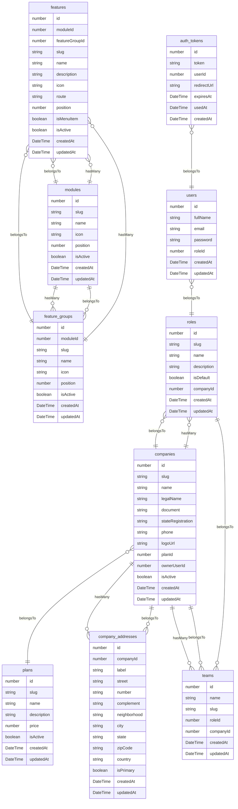

# Models — Diagrama ER

> Arquivo gerado automaticamente por `node ace graph:generate`. Não edite manualmente.

## Diagrama

## Tabela de Models

| Model | Tabela | Colunas | Relações |
| --- | --- | --- | --- |
| AuthToken | auth_tokens | id, token, userId, redirectUrl, expiresAt, usedAt, createdAt | belongsTo → User |
| Company | companies | id, slug, name, legalName, document, stateRegistration, phone, logoUrl, planId, ownerUserId, isActive, createdAt, updatedAt | belongsTo → Plan, hasMany → CompanyAddress, hasMany → Team, hasMany → Role |
| CompanyAddress | company_addresses | id, companyId, label, street, number, complement, neighborhood, city, state, zipCode, country, isPrimary, createdAt, updatedAt | belongsTo → Company |
| Feature | features | id, moduleId, featureGroupId, slug, name, description, icon, route, position, isMenuItem, isActive, createdAt, updatedAt | belongsTo → Module, belongsTo → FeatureGroup |
| FeatureGroup | feature_groups | id, moduleId, slug, name, icon, position, isActive, createdAt, updatedAt | belongsTo → Module, hasMany → Feature |
| Module | modules | id, slug, name, icon, position, isActive, createdAt, updatedAt | hasMany → FeatureGroup, hasMany → Feature |
| Plan | plans | id, slug, name, description, price, isActive, createdAt, updatedAt |  |
| Role | roles | id, slug, name, description, isDefault, companyId, createdAt, updatedAt | belongsTo → Company |
| Team | teams | id, name, slug, roleId, companyId, createdAt, updatedAt | belongsTo → Company, belongsTo → Role |
| User | users | id, fullName, email, password, roleId, createdAt, updatedAt | belongsTo → Role |
