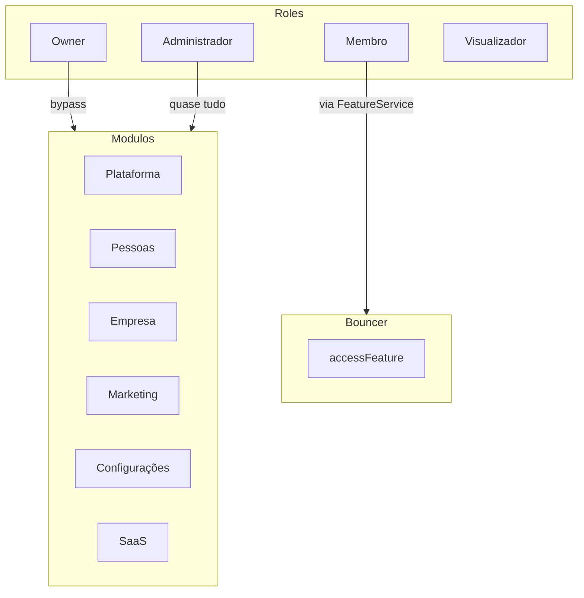

# Permissions — Mapa de Permissões

> Arquivo gerado automaticamente por `node ace graph:generate`. Não edite manualmente.

## Diagrama

## Roles

| Slug | Nome | Descrição |
| --- | --- | --- |
| owner | Owner | Super admin do SaaS. Acesso irrestrito. |
| admin | Administrador | Proprietário de company. Acesso total dentro do plano. |
| member | Membro | Acesso às features da sua role e teams. |
| viewer | Visualizador | Apenas leitura. |

## Módulos

| Slug | Nome |
| --- | --- |
| plataforma | Plataforma |
| pessoas | Pessoas |
| empresa | Empresa |
| marketing | Marketing |
| configuracoes | Configurações |
| saas | SaaS |

## Features

| Slug | Nome | Rota |
| --- | --- | --- |
| home | Home | / |
| profile | Perfil | /profile |
| users.list | Usuários | /users |
| users.create | Criar Usuário | /users/create |
| teams.list | Times | /teams |
| teams.create | Criar Time | /teams/create |
| company.view | Dados da Empresa | /company |
| company.edit | Editar Empresa | /company/edit |
| company.addresses.list | Endereços | /company/addresses |
| company.addresses.create | Novo Endereço | /company/addresses/create |
| campaigns.list | Campanhas | /campaigns |
| campaigns.create | Criar Campanha | /campaigns/create |
| roles.list | Papéis | /roles |
| roles.create | Criar Papel | /roles/create |
| features.list | Features | /features |
| features.create | Criar Feature | /features/create |
| features.edit | Editar Feature | /features/:id/edit |

## Bouncer Rules

| Rule |
| --- |
| accessFeature |
