# Routes — Mapa de Rotas

> Arquivo gerado automaticamente por `node ace graph:generate`. Não edite manualmente.

## Diagrama

```mermaid
flowchart LR
  subgraph localhost
    signup["GET signup"]
    signup["POST signup"]
    login["GET login"]
    login["POST login"]
    auth_callback["GET auth/callback"]
    logout_global["GET logout"]
    workspace["GET workspace"]
    logout["POST logout"]
    workspace["GET workspace"]
    profile["GET profile"]
    profile_update["PATCH profile"]
    users["GET users"]
    users_updateRole["PATCH users/:id/role"]
    roles["GET roles"]
    roles_store["POST roles"]
    roles_updateFeatures["PATCH roles/:id/features"]
    roles_destroy["DELETE roles/:id"]
    teams["GET teams"]
    teams_store["POST teams"]
    teams_update["PATCH teams/:id"]
  end
  subgraph admin
    admin_profile["GET profile"]
    admin_profile_update["PATCH profile"]
    admin_users["GET users"]
    admin_users_updateRole["PATCH users/:id/role"]
    admin_roles["GET roles"]
    admin_roles_store["POST roles"]
    admin_roles_updateFeatures["PATCH roles/:id/features"]
    admin_roles_destroy["DELETE roles/:id"]
    admin_teams["GET teams"]
    admin_teams_store["POST teams"]
    admin_teams_update["PATCH teams/:id"]
    admin_teams_destroy["DELETE teams/:id"]
    admin_features["GET features"]
    admin_features_store["POST features"]
    admin_features_update["PATCH features/:id"]
    admin_logout["POST logout"]
    admin_campaigns["GET campaigns"]
    admin_campaigns_create["GET campaigns/create"]
    admin_settings["GET settings"]
    admin_home["GET /"]
  end
  subgraph tenant
    tenant_profile["GET profile"]
    tenant_profile_update["PATCH profile"]
    tenant_users["GET users"]
    tenant_users_updateRole["PATCH users/:id/role"]
    tenant_roles["GET roles"]
    tenant_roles_store["POST roles"]
    tenant_roles_updateFeatures["PATCH roles/:id/features"]
    tenant_roles_destroy["DELETE roles/:id"]
    tenant_teams["GET teams"]
    tenant_teams_store["POST teams"]
    tenant_teams_update["PATCH teams/:id"]
    tenant_teams_destroy["DELETE teams/:id"]
    tenant_logout["POST logout"]
    tenant_company["GET company"]
    tenant_campaigns["GET campaigns"]
    tenant_campaigns_create["GET campaigns/create"]
    tenant_settings["GET settings"]
    tenant_home["GET /"]
  end
```

## Tabela de Rotas

| Método | Path | Controller | Action | Nome | Domínio |
| --- | --- | --- | --- | --- | --- |
| GET | signup | NewAccount | create | - | localhost |
| POST | signup | NewAccount | store | - | localhost |
| GET | login | Session | create | - | localhost |
| POST | login | Session | store | - | localhost |
| GET | auth/callback | Session | callback | auth.callback | localhost |
| GET | logout | Session | destroyGlobal | logout.global | localhost |
| GET | workspace | Session | workspace | workspace | localhost |
| POST | logout | Session | destroy | logout | localhost |
| GET | profile | Profile | show | admin.profile | admin |
| PATCH | profile | Profile | update | admin.profile.update | admin |
| GET | users | Users | index | admin.users | admin |
| PATCH | users/:id/role | Users | updateRole | admin.users.updateRole | admin |
| GET | roles | Roles | index | admin.roles | admin |
| POST | roles | Roles | store | admin.roles.store | admin |
| PATCH | roles/:id/features | Roles | updateFeatures | admin.roles.updateFeatures | admin |
| DELETE | roles/:id | Roles | destroy | admin.roles.destroy | admin |
| GET | teams | Teams | index | admin.teams | admin |
| POST | teams | Teams | store | admin.teams.store | admin |
| PATCH | teams/:id | Teams | update | admin.teams.update | admin |
| DELETE | teams/:id | Teams | destroy | admin.teams.destroy | admin |
| GET | features | Features | index | admin.features | admin |
| POST | features | Features | store | admin.features.store | admin |
| PATCH | features/:id | Features | update | admin.features.update | admin |
| POST | logout | Session | destroy | admin.logout | admin |
| GET | profile | Profile | show | tenant.profile | tenant |
| PATCH | profile | Profile | update | tenant.profile.update | tenant |
| GET | users | Users | index | tenant.users | tenant |
| PATCH | users/:id/role | Users | updateRole | tenant.users.updateRole | tenant |
| GET | roles | Roles | index | tenant.roles | tenant |
| POST | roles | Roles | store | tenant.roles.store | tenant |
| PATCH | roles/:id/features | Roles | updateFeatures | tenant.roles.updateFeatures | tenant |
| DELETE | roles/:id | Roles | destroy | tenant.roles.destroy | tenant |
| GET | teams | Teams | index | tenant.teams | tenant |
| POST | teams | Teams | store | tenant.teams.store | tenant |
| PATCH | teams/:id | Teams | update | tenant.teams.update | tenant |
| DELETE | teams/:id | Teams | destroy | tenant.teams.destroy | tenant |
| POST | logout | Session | destroy | tenant.logout | tenant |
| GET | workspace | Session | workspace | workspace | localhost |
| GET | profile | Profile | show | profile | localhost |
| PATCH | profile | Profile | update | profile.update | localhost |
| GET | users | Users | index | users | localhost |
| PATCH | users/:id/role | Users | updateRole | users.updateRole | localhost |
| GET | roles | Roles | index | roles | localhost |
| POST | roles | Roles | store | roles.store | localhost |
| PATCH | roles/:id/features | Roles | updateFeatures | roles.updateFeatures | localhost |
| DELETE | roles/:id | Roles | destroy | roles.destroy | localhost |
| GET | teams | Teams | index | teams | localhost |
| POST | teams | Teams | store | teams.store | localhost |
| PATCH | teams/:id | Teams | update | teams.update | localhost |
| DELETE | teams/:id | Teams | destroy | teams.destroy | localhost |
| GET | features | Features | index | features | localhost |
| POST | features | Features | store | features.store | localhost |
| PATCH | features/:id | Features | update | features.update | localhost |
| POST | logout | Session | destroy | logout | localhost |
| GET | /workspace | Session | workspace | workspace.fallback | localhost |
| GET | campaigns | inline | renderInertia('placeholder') | admin.campaigns | admin |
| GET | campaigns/create | inline | renderInertia('placeholder') | admin.campaigns.create | admin |
| GET | settings | inline | renderInertia('placeholder') | admin.settings | admin |
| GET | company | inline | renderInertia('placeholder') | tenant.company | tenant |
| GET | campaigns | inline | renderInertia('placeholder') | tenant.campaigns | tenant |
| GET | campaigns/create | inline | renderInertia('placeholder') | tenant.campaigns.create | tenant |
| GET | settings | inline | renderInertia('placeholder') | tenant.settings | tenant |
| GET | company | inline | renderInertia('placeholder') | company | localhost |
| GET | company/edit | inline | renderInertia('placeholder') | company.edit | localhost |
| GET | company/addresses | inline | renderInertia('placeholder') | company.addresses.list | localhost |
| GET | company/addresses/create | inline | renderInertia('placeholder') | company.addresses.create | localhost |
| GET | campaigns | inline | renderInertia('placeholder') | campaigns | localhost |
| GET | campaigns/create | inline | renderInertia('placeholder') | campaigns.create | localhost |
| GET | settings | inline | renderInertia('placeholder') | settings | localhost |
| GET | / | inline | renderInertia('home') | admin.home | admin |
| GET | / | inline | renderInertia('home') | tenant.home | tenant |
| GET | / | inline | renderInertia('home') | home | localhost |
