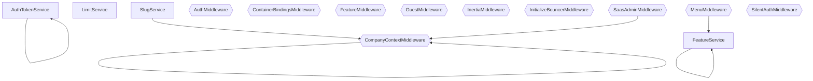

# Services & Middleware — Grafo de Dependências

> Arquivo gerado automaticamente por `node ace graph:generate`. Não edite manualmente.

## Diagrama

## Tabela de Services e Middleware

| Nome | Tipo | Imports | Métodos |
| --- | --- | --- | --- |
| AuthTokenService | service | #models/auth_token | generate, validate, cleanup |
| FeatureService | service | #models/feature, #models/module | getUserFeatures, getUserMenu, userCanAccess, loadUserRoleSlug |
| LimitService | service | #models/module | check, canCreateUser, canCreateTeam |
| SlugService | service | #models/company | slugify, generateCompanySlug |
| AuthMiddleware | middleware | - | handle |
| CompanyContextMiddleware | middleware | #models/company | handle |
| ContainerBindingsMiddleware | middleware | - | - |
| FeatureMiddleware | middleware | - | handle |
| GuestMiddleware | middleware | - | handle |
| InertiaMiddleware | middleware | - | handle |
| InitializeBouncerMiddleware | middleware | - | handle |
| MenuMiddleware | middleware | #services/feature_service | handle |
| SaasAdminMiddleware | middleware | #models/company | handle |
| SilentAuthMiddleware | middleware | - | handle |
