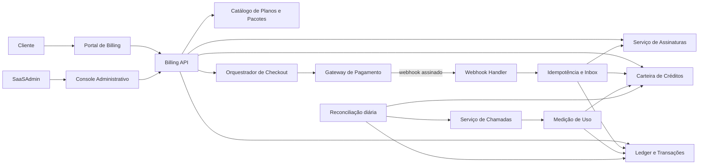
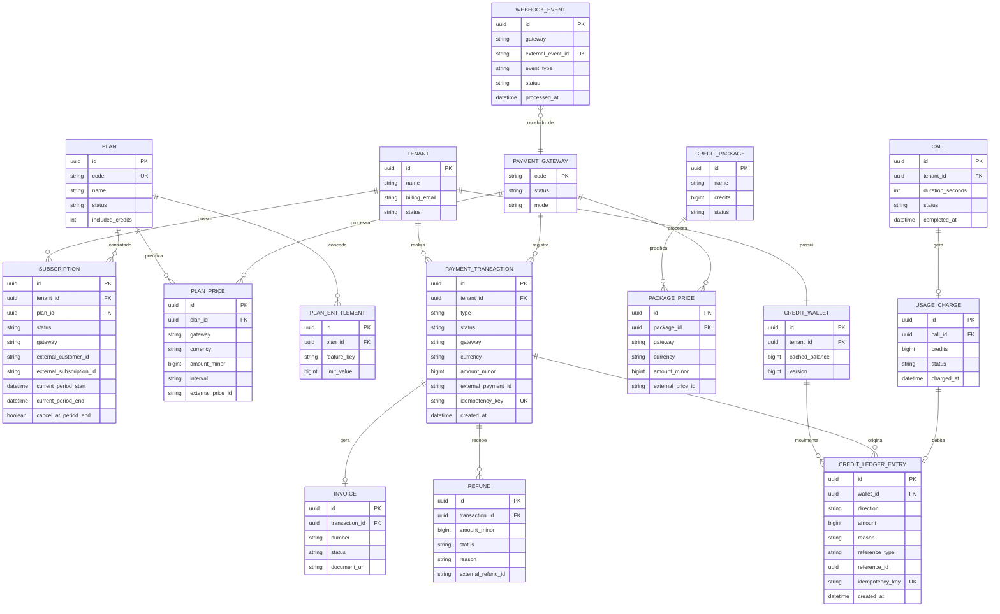
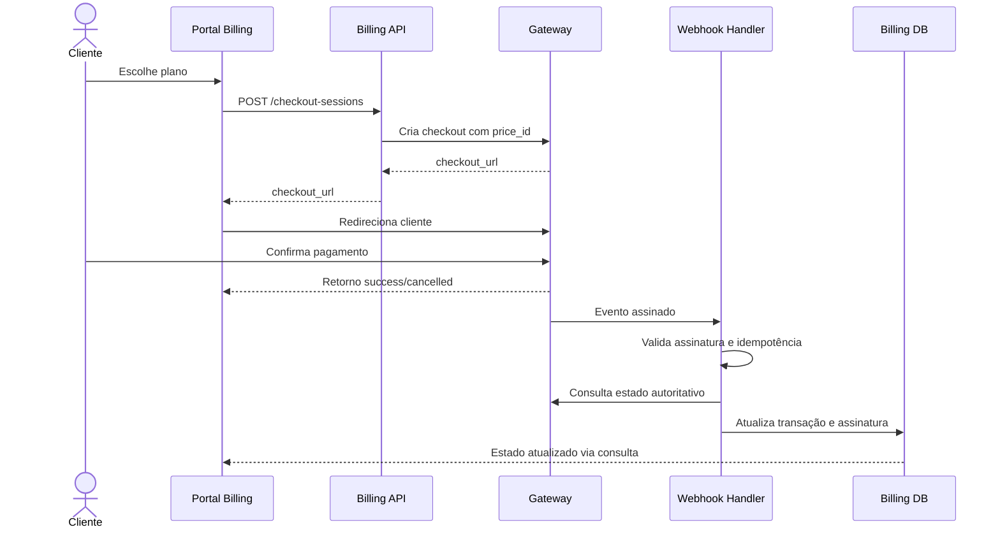
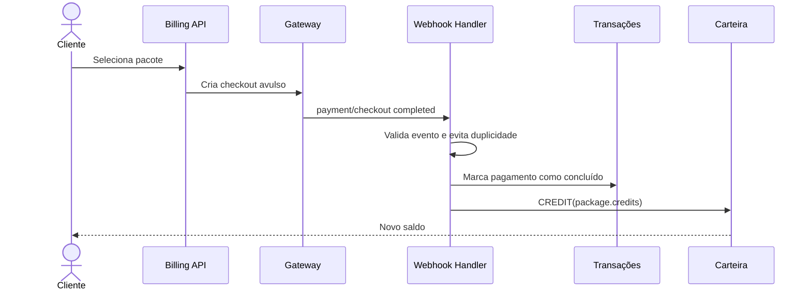
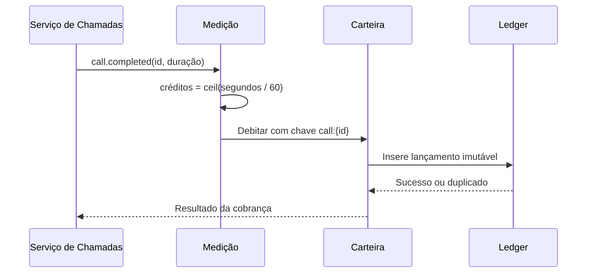
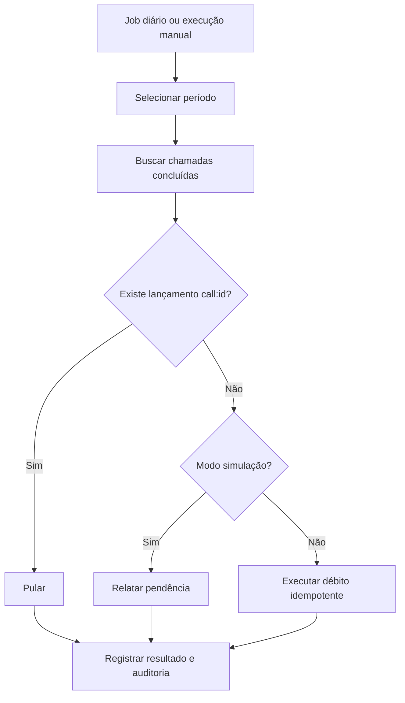

# Especificação de referência — Billing SaaS AnyAtende

## 1. Objetivo e escopo

Reproduzir em outro SaaS o modelo de faturamento observado no AnyAtende, cobrindo:

- contratação e manutenção de planos recorrentes;
- compra avulsa de créditos;
- consumo de créditos por chamada;
- histórico financeiro e operacional do cliente;
- administração de planos, pacotes, transações e gateways;
- processamento assíncrono por webhooks;
- reconciliação/backfill de chamadas não cobradas.

Esta especificação separa **comportamento observado** e **arquitetura recomendada**. Os nomes de entidades e APIs são propostas para implementação; não representam necessariamente o código interno do sistema analisado.

## 2. Comportamento observado

### 2.1 Portal do cliente — `/app/billing`

Resumo superior:

- saldo atual de créditos;
- plano atual;
- quantidade de transações;
- estado da assinatura.

Abas:

1. **Planos**
   - mostra plano atual, moeda e periodicidade;
   - compara Free, Pro e Premium;
   - permite upgrade para plano elegível;
   - apresenta limites de agentes, campanhas, contatos, webhooks, bases de conhecimento, fluxos, números e créditos incluídos;
   - recursos adicionais podem ser condicionados ao plano, como suporte prioritário, SIP Trunk e API REST.

2. **Pacotes de Créditos**
   - mostra saldo disponível;
   - lista pacotes ativos com quantidade, preço total e preço unitário;
   - oferece compra avulsa;
   - pacotes maiores recebem desconto progressivo.

3. **Histórico de Transações**
   - tabela com tipo, descrição, valor em créditos e data;
   - exportação CSV;
   - débitos de chamadas descrevem provedores, origem, destino e duração.

Regra observada de consumo:

```text
créditos_consumidos = ceil(duração_da_chamada_em_segundos / 60)
```

Exemplos observados: 22 segundos = 1 crédito; 72 segundos = 2 créditos; 218 segundos = 4 créditos.

### 2.2 SaaSAdmin — Faturamento

Abas principais:

1. **Planos**
   - criar e editar planos;
   - definir preço mensal e anual por moeda/gateway;
   - definir limites e créditos incluídos;
   - acompanhar sincronização com Stripe;
   - classificar modelos LLM por nível Free/Pro e ativá-los/desativá-los.

2. **Créditos**
   - criar, editar, ativar e desativar pacotes;
   - definir nome, descrição, quantidade, preço e gateway/moeda;
   - calcular preço por crédito.

3. **Transações**
   - visão geral com receita, número de transações, reembolsos, gateways e taxa de sucesso;
   - filtros por usuário, e-mail, identificador, gateway, tipo e status;
   - áreas para transações, faturas e notas de reembolso;
   - cortes semanal, mensal, anual e todo o período.

4. **Backfill**
   - varre chamadas concluídas sem lançamento de crédito;
   - período configurável em dias;
   - simulação sem dedução;
   - execução real por caminho idempotente;
   - varredura automática diária.

5. **Pagamentos**
   - gateways previstos: Stripe/BRL, Razorpay/INR, PayPal/USD, Paystack/NGN e Mercado Pago/BRL;
   - no estado observado, somente Stripe/BRL estava habilitado;
   - configura chaves, segredo de webhook, moeda e modo teste/produção;
   - URLs de sucesso e cancelamento retornam ao billing do cliente;
   - a assinatura só deve ser atualizada após verificação do pagamento no gateway.

Eventos Stripe observados:

- `checkout.session.completed`;
- `invoice.payment_succeeded`;
- `invoice.payment_failed`;
- `customer.subscription.deleted`;
- `customer.subscription.updated`;
- `charge.dispute.created`;
- `charge.refunded`.

## 3. Arquitetura funcional recomendada



Princípios:

- gateway não é fonte única de verdade do produto; ele confirma eventos financeiros;
- saldo deriva de um ledger imutável, não de atualizações soltas;
- webhooks e consumo de chamadas devem ser idempotentes;
- preços são armazenados em unidades monetárias mínimas, por exemplo centavos;
- moeda pertence ao preço, não apenas ao plano;
- permissões/limites vêm do plano efetivamente ativo.

## 4. Modelo de dados recomendado



## 5. Fluxos principais

### 5.1 Contratação ou upgrade



O retorno `success=true` não ativa sozinho a assinatura. A ativação ocorre pelo webhook verificado ou por consulta server-to-server ao gateway.

### 5.2 Compra de créditos



### 5.3 Débito por chamada



### 5.4 Backfill



## 6. Estados e regras de negócio

### 6.1 Assinatura

Estados recomendados:

- `incomplete`;
- `trialing`;
- `active`;
- `past_due`;
- `paused`;
- `cancel_at_period_end`;
- `canceled`;
- `unpaid`.

Regras:

- somente `active` e, se desejado, `trialing` concedem todos os entitlements;
- falha de pagamento não deve apagar imediatamente dados do cliente;
- downgrade deve definir como tratar recursos acima do novo limite;
- cancelamento pode ser imediato ou no fim do período, mas a política deve ser explícita;
- créditos incluídos devem definir se renovam, acumulam ou expiram.

### 6.2 Pagamento

Estados recomendados:

- `pending`, `processing`, `succeeded`, `failed`, `canceled`, `partially_refunded`, `refunded`, `disputed`.

Tipos:

- `subscription`, `credit_package`, `manual_adjustment`.

### 6.3 Ledger de créditos

Razões mínimas:

- `plan_grant`;
- `package_purchase`;
- `call_usage`;
- `refund_reversal`;
- `admin_adjustment`;
- `expiration`;
- `migration_backfill`.

Regras críticas:

- valores do ledger são inteiros;
- lançamento não é editado ou apagado; correções usam lançamento compensatório;
- toda mutação exige `idempotency_key` única;
- `cached_balance` é atualizado na mesma transação do banco ou reconstruído pelo ledger;
- definir política de saldo insuficiente: bloquear chamada, permitir saldo negativo limitado ou reserva prévia.

## 7. APIs sugeridas

### Cliente

- `GET /api/billing/summary`
- `GET /api/billing/plans`
- `POST /api/billing/checkout-sessions`
- `GET /api/billing/credit-packages`
- `POST /api/billing/credit-purchases`
- `GET /api/billing/ledger`
- `GET /api/billing/ledger.csv`
- `POST /api/billing/subscription/cancel`
- `POST /api/billing/subscription/resume`
- `GET /api/billing/invoices`

### Administração

- `GET|POST /api/admin/billing/plans`
- `PATCH /api/admin/billing/plans/{id}`
- `GET|POST /api/admin/billing/credit-packages`
- `PATCH /api/admin/billing/credit-packages/{id}`
- `GET /api/admin/billing/transactions`
- `GET /api/admin/billing/metrics`
- `GET /api/admin/billing/invoices`
- `GET /api/admin/billing/refunds`
- `POST /api/admin/billing/refunds`
- `POST /api/admin/billing/backfill/scan`
- `POST /api/admin/billing/backfill/execute`
- `GET|PATCH /api/admin/billing/gateways/{gateway}`
- `POST /api/admin/billing/gateways/{gateway}/test`

### Webhooks internos/externos

- `POST /api/webhooks/stripe`
- `POST /api/webhooks/{gateway}`
- evento interno `call.completed`
- evento interno `subscription.changed`
- evento interno `credits.changed`

## 8. Requisitos não funcionais e segurança

- validar assinatura criptográfica do webhook sobre o corpo bruto;
- nunca expor chaves secretas no cliente ou em logs;
- criptografar credenciais de gateway em repouso;
- RBAC separado para billing administrativo, reembolsos e credenciais;
- trilha de auditoria para alteração de preços, planos, pacotes, saldo e gateway;
- idempotência tanto em requisições de checkout quanto em webhooks;
- processamento de webhook com fila, tentativas e dead-letter queue;
- transações ACID para pagamento concluído + crédito concedido;
- valores monetários inteiros e moeda ISO 4217;
- observabilidade com correlação entre tenant, checkout, pagamento, webhook e lançamento;
- não armazenar dados completos de cartão; usar checkout/tokenização do gateway;
- LGPD: minimização, retenção e exportação dos dados financeiros aplicáveis.

## 9. Critérios de aceite mínimos

1. Um evento repetido do gateway não duplica assinatura, pagamento nem créditos.
2. O retorno de sucesso sem webhook válido não ativa o plano.
3. Uma chamada de 62 segundos consome exatamente 2 créditos.
4. Reprocessar a mesma chamada não cria novo débito.
5. Compra confirmada concede exatamente a quantidade configurada no pacote.
6. Reembolso atualiza transação e executa a política de reversão de créditos.
7. Alterar preço cria nova versão; assinaturas existentes preservam o preço contratado até migração explícita.
8. Desativar pacote impede novas compras, sem apagar o histórico.
9. Backfill em simulação não altera saldo.
10. Backfill real ignora chamadas já cobradas.
11. Usuário não administrador não acessa endpoints administrativos.
12. Relatórios podem ser reconciliados com gateway e ledger.

## 10. Decisões que precisam ser fechadas antes do desenvolvimento

- créditos incluídos renovam mensalmente, acumulam ou expiram?
- usuários Free podem comprar pacotes ou somente assinantes Premium?
- qual é a política para saldo insuficiente durante uma chamada?
- upgrade é imediato e proporcional; downgrade ocorre no próximo ciclo?
- haverá teste grátis?
- o sistema emitirá documento fiscal ou apenas invoice/recibo do gateway?
- reembolso remove créditos não utilizados, permite saldo negativo ou exige análise manual?
- preços serão globais por moeda ou específicos por região/gateway?
- Mercado Pago e demais gateways fazem parte do MVP ou entram depois?

## 11. Ordem sugerida de implementação

1. Catálogo versionado de planos, preços, pacotes e entitlements.
2. Ledger e carteira de créditos com idempotência.
3. Integração Stripe em modo teste, checkout e webhooks.
4. Assinaturas e concessão de créditos incluídos.
5. Compra avulsa de pacotes.
6. Débito idempotente por chamada.
7. Portal do cliente e exportação do histórico.
8. Console administrativo e métricas.
9. Reembolsos, reconciliação e backfill.
10. Gateways adicionais por adaptadores.
