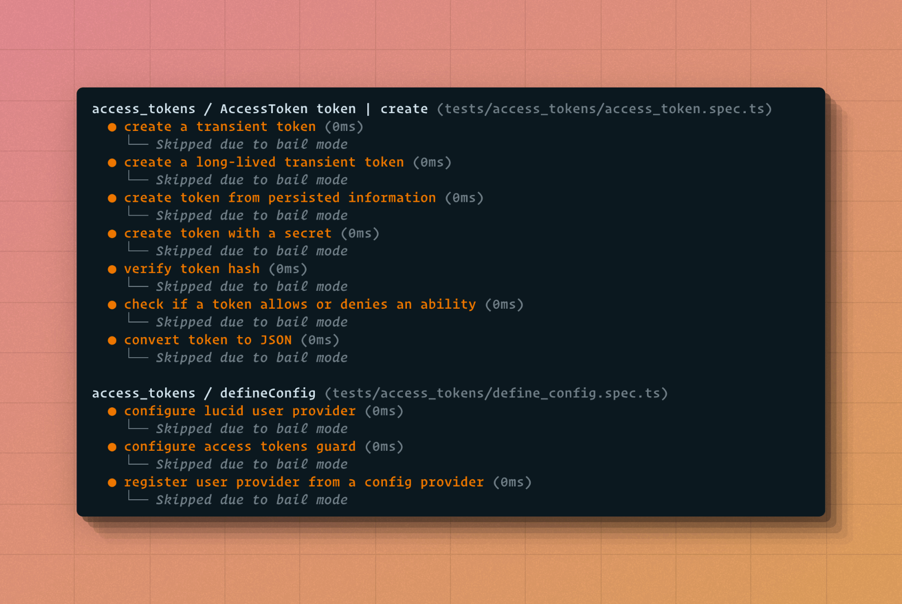

# Bail mode
In bail mode, Japa will skip the upcoming tests after an error. You can enable the bail mode using the `--bail` CLI flag. For example:

```sh
node bin/test.js --bail
```



By default, the bail mode is applied globally and all the upcoming tests across multiple groups and suites will be skipped.

However, you can also specify the layer at which the bail mode should be applied using the `--bail-layer` CLI flag.

```sh
node bin/test.js --bail --bail-layer=suite

node bin/test.js --bail --bail-layer=group
```

- The `--bail-layer=suite` will skip tests from the current suite. However, the tests from other suites will continue to run.
- The `--bail-layer=group` will skip tests from the current group. However, the tests from other groups will continue to run.
